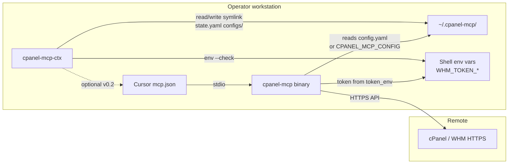

# Architecture — cpanel-mcp-ctx

## System context



The switcher sits **outside** the MCP process. It only manages filesystem state that the existing MCP server already knows how to load.

---

## Components (Go packages)

| Package | Responsibility |
|---------|----------------|
| `cmd/cpanel-mcp-ctx` | `main`, version/build flags |
| `internal/cli` | Cobra command tree, flag parsing |
| `internal/store` | Profile CRUD, symlink switch, `state.yaml` |
| `internal/validate` | YAML schema subset matching cPanel MCP |
| `internal/redact` | Safe `show` output (hosts, usernames, token_env names) |
| `internal/paths` | Resolve `~/.cpanel-mcp`, expand home, default constants |

No network I/O in v1.

---

## On-disk contract

### Paths

| Path | Type | Mode | Content |
|------|------|------|---------|
| `~/.cpanel-mcp/` | directory | `0700` | Root state dir |
| `~/.cpanel-mcp/configs/` | directory | `0700` | One YAML per profile |
| `~/.cpanel-mcp/configs/<profile>.yaml` | file | `0600` | Full cPanel MCP config |
| `~/.cpanel-mcp/config.yaml` | symlink | — | → `configs/<current>.yaml` |
| `~/.cpanel-mcp/state.yaml` | file | `0600` | Current profile + metadata |

### Profile naming rules

- `[a-z0-9][a-z0-9._-]{0,63}` (DNS-like, case-sensitive display)
- Reserved: `state`, `config`, `configs`, `.`, `..`
- Collision with existing file → error on `add`

### Switch algorithm (`use`)

1. Verify `configs/<profile>.yaml` exists.
2. Run `validate` on target file.
3. Write new symlink to temp path in same directory (`config.yaml.new`).
4. `rename(2)` temp → `config.yaml` (atomic on same filesystem).
5. Update `state.yaml` `current` field (write temp + rename).
6. Emit human-readable confirmation (profile name, resolved path, server count).

If step 5 fails after step 4, log warning — symlink is already correct; state can be repaired with `current --repair`.

---

## Integration with cPanel MCP config precedence

The MCP server resolves config in this order:

1. CLI `--config`
2. `CPANEL_MCP_CONFIG`
3. `~/.cpanel-mcp/config.yaml`
4. `/etc/cpanel-mcp/config.yaml`

**Recommended operator setup:**

```json
{
  "mcpServers": {
    "cpanel": {
      "command": "cpanel-mcp",
      "args": ["--config", "/home/USER/.cpanel-mcp/config.yaml"],
      "env": {
        "CPANEL_UAPI_TOKEN": "...",
        "WHM_TOKEN_PROD": "..."
      }
    }
  }
}
```

Using the symlink path explicitly avoids ambiguity if `state.yaml` and symlink ever diverge.

**Multi-server within one profile:** unchanged — one YAML can still define `servers:` with many entries (`prod-root`, `customer-acme`, …). The switcher switches **profiles** (whole files), not individual MCP `server` keys. That matches AWS profiles more than kubectl contexts inside one kubeconfig.

If we later need per-server context inside one profile, that remains cPanel MCP’s `default_server` field — out of scope for v1.

---

## Comparison to reference tools

| Feature | AWS CLI | kubectl | cpanel-mcp-ctx (v1) |
|---------|---------|---------|---------------------|
| Multiple configs | profiles in shared files | contexts in one kubeconfig | separate YAML per profile |
| Switch command | `export AWS_PROFILE=` | `kubectl config use-context` | `cpanel-mcp-ctx use` |
| Credentials on disk | optional in `~/.aws/credentials` | certs/ tokens in kubeconfig | **discouraged** — `token_env` only |
| Active marker | env var | kubeconfig `current-context` | symlink + `state.yaml` |

---

## Failure modes

| Failure | Behaviour |
|---------|-----------|
| Missing `configs/<profile>.yaml` | Error on `use`; suggest `list` |
| Invalid YAML | Error on `use` / `add`; `validate` details |
| Active profile deleted | Symlink dangling; `current` detects and suggests `use` |
| Permission too open | `validate` warns; `init`/`add` fix to 0600/0700 |
| MCP not restarted after switch | **cpanel-mcp ≥ hot-reload:** next tool call reloads symlink; `list_servers` exposes `active_profile`. Restart MCP only if stale config persists |

---

## Future: shared validation with MCP

Option A (preferred long-term): add `cpanel-mcp config validate --file path` to upstream; switcher calls it as subprocess.

Option B: embed duplicate validation in Go from documented schema (faster, risks drift).

Option C: JSON Schema generated once from docs and shared as submodule artifact.

v1 uses **Option B** with tests fixture copied from `mcp/python/tests` / `mcp/typescript/test` config samples.
